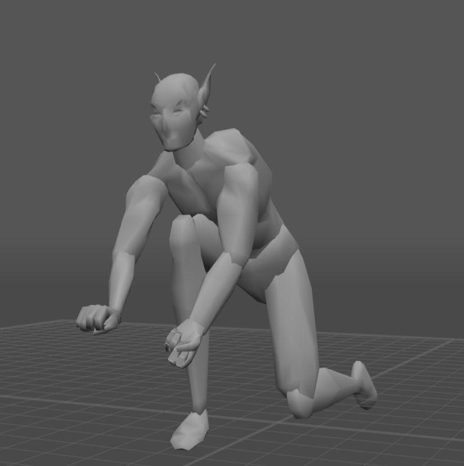

# OpenMW Experimental Mods
Experimental mods for OpenMW, quite often made to test the latest OpenMW developmental features.

## How to install
- Copy the "Data Files" folder into your ".../Morrowind" folder.
- Register the "Data Files/scripts/MaxYari/Experiments" folder in your data directories. The most user-friendly way to do that is via OpenMW launcher "Data Directories" tab. Use "Append" button there.
- After that enable the .omwscript file in "Content Files" tab of the launcher. Since this is a collection of mods - there will be multiple .omwscript files, I'm assuming you already know which mod you want to try/test. Enabling all of them at the same time might break something... or not.

Have fun!

## Credit

Physics sound effects by a dear friend https://nimsound.ru/

## Mods

### Mercy: CAO

Mercy: Combat AI Overhaul. 
A significant overhaul of in-combat NPC behavior using custom lua behavior trees library, with new voice lines and animations. Only melee NPCs are affected.
New unique ElevenLabs-generated voice lines by [Von Django](https://next.nexusmods.com/profile/Von%20Django/about-me?gameId=100).

### PhysicsInteractions

A mod for testing an experimental OpenMW physics branch. 
Grab and drag objects around by holding X in a similar (but not as granular) fashion to Oblivion/Skyrim. Press LMB while holding an object to throw it. Thrown items can damage NPCs. The damage and the throw strength are dependent on your strength stat.

### PlayerMovement

A mod for testing new actor movement lua bindings, also an experimental branch. Press jump in the air to air-dash.

