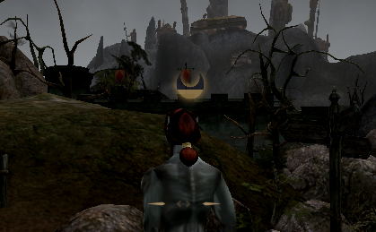

# OpenMW Experimental Mods
Experimental mods for OpenMW, quite often made to test the latest OpenMW developmental features. Most of these mods are made to test specific OpenMW merge requests or branches and will not work without them.

## How to install
- Place the contents of this repository into your ".../Morrowind/Data Files" folder.
- After that enable the .omwscript file in "Content Files" tab of the launcher. Since this is a collection of mods - there will be multiple .omwscript files, I'm assuming you already know which mod you want to try/test. Enabling all of them at the same time might break something... or not.

Have fun!

## Credit

Physics sound effects by a dear friend https://nimsound.ru/

A LOT of sneak-detection code was lifted from [Burglary Overhaul](https://www.nexusmods.com/morrowind/mods/56965) by [blurpandra](https://www.nexusmods.com/profile/blurpandra/mods). Great thanks for that!

### Sneak!

A conservative reimplementation of a sneaking system For OpenMW 0.5+.

Your paws are silent and grace is your second name, yet for some unfathomable reason these meatbags can spot you out of a blue, as if they have a sixth sense for you? Can they hear you? Can they smell you? No! It's an invisible dice roll that just instantly failed your covert infiltration without a prior warning nor indication. 

No more I say!

This conservative overhaul of the sneak system at large leaves vanilla formulas and dice rolls intact, yet now the failure is not instant, NPCs will display a detection progress with your sneak stats and invisible dice rolls affecting how quickly it fills or falls.
Once again, same stats and bonuses apply as in vanilla, such as sneak, agility, luch, chameleon e.t.c - all increasing you overall sneaking ability and therefore the speed at which the detection progress fills in (if at all).

Some might even say that this mod "modernises" the sneak system. Eww.

**Installation**: Activate Sneak.omwaddon and Sneak.omwscripts

**Want to playtest?**: The system is fairly jank, it reimplements vanilla detection formulas, makes vanilla sneak never fail and kicks you out of sneak stance whenever mod's sneak fails, so you can be detected by the NPCs. This means that theres a great potential for strange exploitable edge-cases. Following things need to be tested and attempted to be broken and exploited:
 - Overall usage, sneaking around, sneak attacking
 - Usage with companions
 - Stealing and pickpocketing
 - Anything else sneak-related you migh imagine
 Thanks for your help!
 Please leave your playtest feedback in "Sneak!" thread in "mod-discussion" channel of OpenMW discord. 

### Looking for ReAnimation or Mercy?

Looking for mods that were previously here? They got mature enough to move to dwellings of their own:

[Mercy: Combat AI Overhaul](https://github.com/MaxYari/OpenMWMercyCAO)
[ReAnimations first-person v2: Rogue](https://github.com/MaxYari/OpenMWReAnimation)

